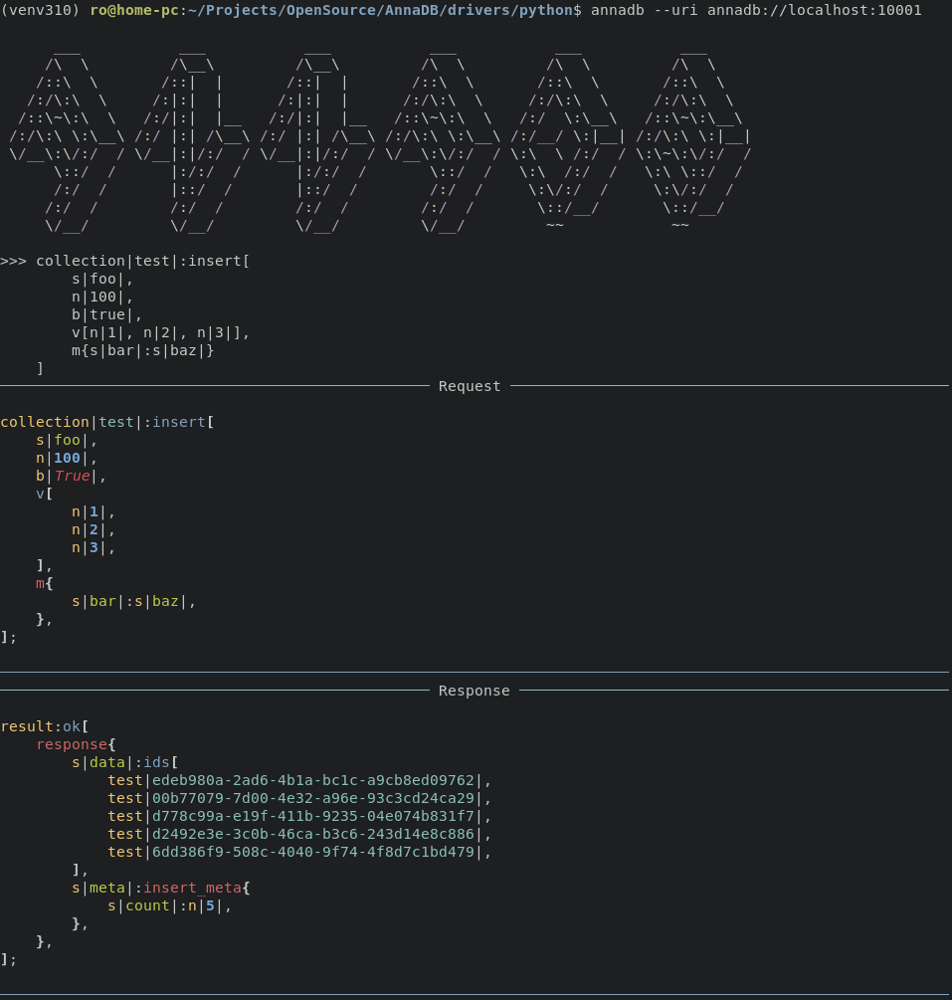

## Collections

AnnaDB stores objects in collections. Collections are analogous to tables in SQL databases. 

Every object and sub-object (item of a vector or map) that was stored in AnnaDB has a link id. This id consists of the collection name and unique uuid4 value. One object can contain links to objects from any collections - AnnaDB will fetch and process them on all the operations automatically without additional commands (joins or lookups)

## TySON

AnnaDB query language uses the `TySON` format. The main difference from other data formats is that each item has a value and prefix. The prefix can mark the data type or query type (as it is used in AnnaDB) or any other information, useful for the parser. This adds more flexibility to the data structure design - it is allowed to use as many custom data types, as the developer needs.

You can read more about the `TySON`
format [here](https://github.com/roman-right/tyson)

## Query

Query in AnnaDB is a pipeline of steps, that should be applied in the order it was declared. The steps are wrapped into a vector with the prefix `q` - query.

<pre><code>collection|test|:q[
	find[
	],
	sort[
		asc(value|num|),
	],
	limit(n|5|),
];
</code></pre>

If the pipeline has only one step, the `q` vector is not needed.

<pre><code>collection|test|:find[
	gt{
		value|num|:n|4|,
	},
];
</code></pre>

## Transaction

Every database call is a transaction with AnnaDB. You can send as many queries as you want together in a single call. If something will go wrong in the middle, all the queries in this transaction will be rolled back. Results of all the queries will be returned together in a vector in the respective order.

<pre><code>collection|test|:q[
	find[
		gt{
			value|num|:n|4|,
		},
	],
	update[
		set{
			value|blink2.a|:n|100|,
		},
	],
];
collection|test|:q[
	find[
	],
	update[
		set{
			value|blink2.e|:n|1000|,
		},
	],
];
</code></pre>

## Client

AnnaDB shell client is an interactive terminal application, that connects to the DB instance, validates and handles queries. It fits well to play with query language or work with the data manually.

## Using from your app

AnnaDB has a Python driver. It has an internal query builder - you don't need to learn AnnaDB query syntax to work with it. But it supports raw querying too.

[Python Driver](https://github.com/roman-right/AnnaDB/tree/main/drivers/python/)

Other languages will be supported soon too. If you want to help me with this, please text me - I'll provide all the information and tools.
